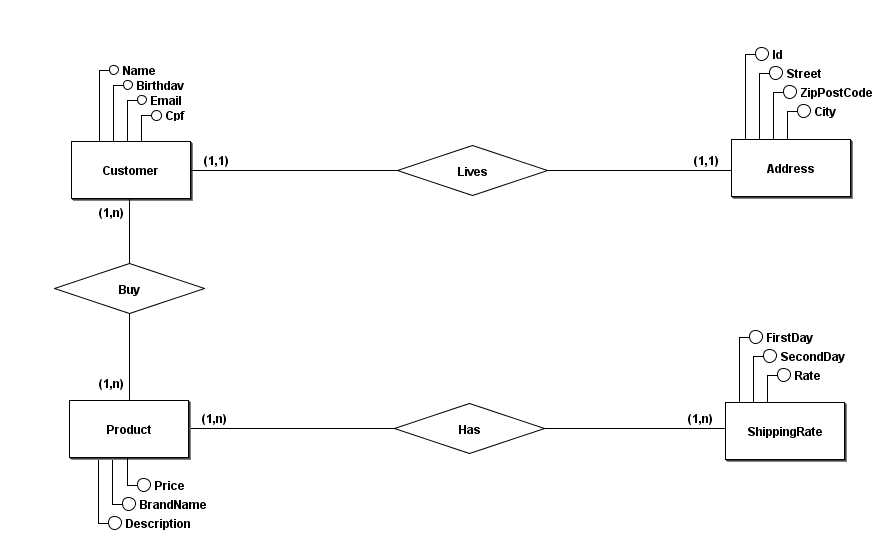
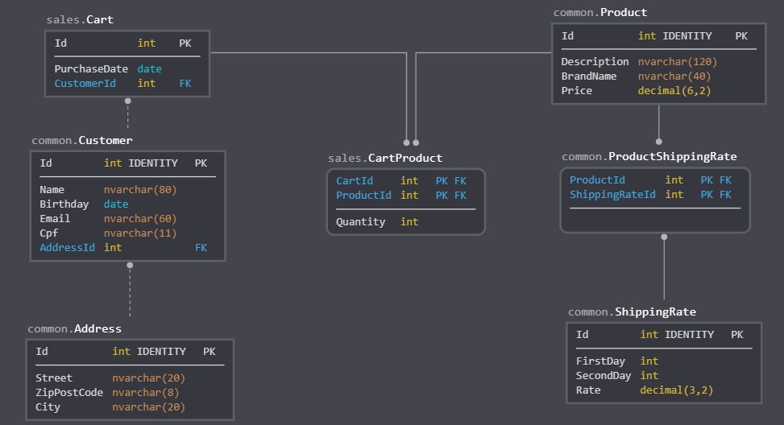
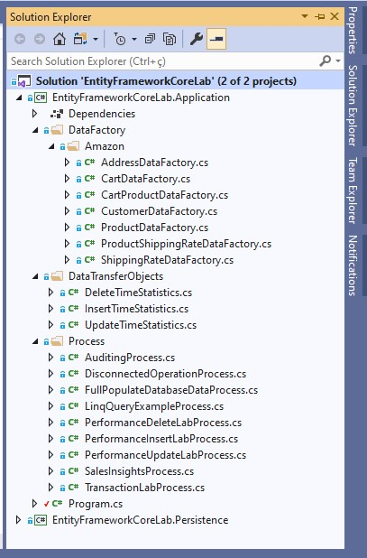
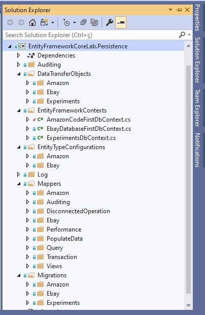
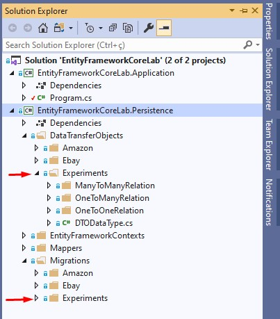

# Entity Framework Core Lab

Aplicação criada com o principal objetivo de explorar os recursos e características do Entity Framework Core.

Nesta aplicação foram experimentados diversos cenários reais de uso baseados em um mini modelo de dados voltado para ecommerce.

Após os estudos de caso, as principais conclusões foram documentadas neste arquivo e servem como referência de uso e fonte de consulta.

**Versões utilizadas:**

>Net Core 3.1

>[Entity Framework Core 3.1.2](https://www.nuget.org/packages/Microsoft.EntityFrameworkCore/3.1.2)

>[Entity.Framework.Core.Sql.Server 3.1.2](https://www.nuget.org/packages/Microsoft.EntityFrameworkCore.SqlServer/3.1.2)

>[Microsoft.EntityFrameworkCore.Tools 3.1.2](https://www.nuget.org/packages/Microsoft.EntityFrameworkCore.Tools/3.1.2)

>[EFCore.BulkExtensions 3.1.1](https://www.nuget.org/packages/EFCore.BulkExtensions/3.1.1)

>[Microsoft.Extensions.Logging.Console 3.1.2](https://www.nuget.org/packages/Microsoft.Extensions.Logging.Console/3.1.2)

>[Faker.Net 1.3.77](https://www.nuget.org/packages/Faker.Net/1.3.77)

>[NBuilder 6.1.0](https://www.nuget.org/packages/NBuilder/6.1.0)

## Pré-requisitos

O que precisa ser instalado na máquina para extender e depurar o projeto:

    Visual Studio Community 2019;
    Net Core SDK 3.1;
    SQL Server

## Como iniciar?

* Instalar e/ou configurar todos os pré-requisitos citados acima;
* Clonar o repositório na máquina local;
* Criar os três bancos de dados usados na aplicação: AmazonCodeFirst, EbayDatabaseFirst e Experiments;
* Baixar as dependências Nuget para a solução no Visual Studio;
* Rodar as migrações para o banco de dados desejado com o comando: Update-Database -Context [ClassName of context];
* Executar a chamada de alguma classe da namespace [Process](./EntityFrameworkCoreLab.Application/Process) no arquivo Program.cs

## Requisitos do projeto

A fim de experimentar os recursos do Entity Framework Core e estabelecer as melhores e mais eficientes práticas de uso, alguns requisitos foram estabelecidos.

Estes requisitos tem como objetivo aproximar o estudo de caso a um cenário real de uso onde diversas características do framework devem ser exploradas.

Abaixo são listados quais requisitos a solução atende:

    Uso de múltiplos bancos de dados;
    Uso de múltiplos schemas;
    Utilizar Model First e Database First;
    Considerar relacionamento 1 x 1 entre tabelas;
    Considerar relacionamento 1 x N entre tabelas;
    Considerar relacionamento N X N entre tabelas;
    Melhor uso de DataAnnotations;
    Comportamento de inserts;
    Comportamento de updates;
    Comportamento de deletes;
    Uso de transações;
    Uso de views;
    Database seed com uso de migrações;
    Entidades que não utilizam chave auto-incremental;
    Avaliar e otimizar performance para operações com grande volume de dados;
    Log de consultas e auditoria de dados;

## Modelo do banco de dados

A fim de exemplificar o uso do Entity Framework foi criado um mini **modelo de banco de dados que possui relacionamentos 1 x 1, 1 x N e N x N**. Esse modelo é voltado para ecommerce e se baseia principalmente em `Clientes` que moram em determinados `Endereços`, estes clientes por sua vez compram diversos `Produtos` e os produtos possuem `Taxas de Entrega` relacionadas.

Abaixo é apresentada uma **modelagem conceitual** do banco de dados. A modelagem foi feita com o apoio da ferramenta [BrModelo](http://www.sis4.com/brModelo/).



Neste diagrama é apresentada a **modelagem lógica** do banco de dados. A modelagem foi feita com o apoio da ferramenta [SqlDBM](https://sqldbm.com/). É importante observar que as tabelas foram divididas em dois esquemas: `common` e `sales`.



## Estrutura do projeto

A solução `EntityFrameworkCoreLab` se divide em dois projetos: `EntityFrameworkCoreLab.Application` e `EntityFrameworkCoreLab.Persistence`. Logo abaixo cada um dos projetos são detalhados.

### EntityFrameworkCoreLab.Application

Trata-se de um `.Net Core Console Application` que tem como responsabilidade ser o ponto de entrada para execução e depuração das classes desenvolvidas na solução. Para realizar a execução, as classes da namespace **Process** devem ser instanciadas e os métodos executados na classe **Program.cs**.



As principais namespaces são `Data Factory` e `Process`.

* **Data Factory**: classes que tem a responsabilidade **de criar objetos fakes** para viabilizar algumas operações nas bases de dados. Esses objetos são criados com o apoio das extensões NBuilder e Faker.Net.

* **Process**: classes que gerenciam chamadas ao projeto `EntityFrameworkCoreLab.Persistence`, que por sua vez faz o acesso as bases de dados. Cada classe possui um conjunto de operações que buscam avaliar um determinado escopo de ações no EF Core.

### EntityFrameworkCoreLab.Persistence

Trata-se de um `.Net Core Class Library` que tem como responsabilidade manter as configurações do EF Core e fazer as operações nas bases de dados.



As principais namespaces são: `DataTransferObjects`, `EntityFrameworkContexts`, `EntityTypeConfigurations`, `Log`, `Mappers` e `Migrations`.

* **DataTransferObjects**: classes que representam os models que mapeiam as tabelas em cada base de dados.

* **EntityFrameworkContexts**: classes que configuram o acesso as bases de dados. Neste estudo de caso foram utilizados três bases de dados.

* **EntityTypeConfigurations**: classes que tem como objetivo modularizar o código de configurações feitas para cada model nos DbContexts.

* **Log**: classes desenvolvidas para realizar a gravação de logs do EF Core em arquivo.

* **Mappers**: classes que fazem as operações CRUD nas bases de dados.

* **Migrations**: classes que representam as migrações que serão aplicadas em cada base de dados.

## Model First x Database First 

As duas principais estratégias para manipulação, atualização e criação de schema de banco de dados utilizando o EF Core são: ``Model First e Database First``.

A estratégia que o autor recomenda que seja utilizada é a **Model First**, entretanto em algumas situações é necessário trabalhar com um banco de dados já definido, com modelo físico já criado. Nesse cenário o EF Core possibilita que seja usada a estratégia **Database First** para uso da base de dados.

Baseado nisso é importante que as três estratégias de configuração do modelo de dados disponibilizadas pelo EF Core sejam explicadas:

* **By Convention**: regras simples adotadas nos tipos e nomes das propriedades para configuração do schema da base de dados. Não atende todos os cenários de configuração;
* **Data annotation**: um conjunto de annotations que podem ser usadas nas classes de entidade e propriedades para configuração;
* **Fluent API**: pode ser utilizada ao sobrescrever o método ``OnModelCreating`` da classe que extende o ``DbContext``. Trata-se da forma mais poderosa e flexível para configuração do modelo de dados, entretanto a configuração pode ficar mais verbosa e complexa.

Um problema observado com a estratégia ``Database First`` é que ela cria muito código desnecessário ou ``boilerplate code``, deixando o modelo de dados criado na aplicação mais complexo e muitas vezes difícil de se entender.

Pensando nisso, baseado nos testes e experimentos feitos no projeto foi estabelecida uma forma de trabalhar com tabelas já existentes usando todo o poder da estratégia **Model First**.

>Caso a tabela já exista no banco de dados é possível criar o `Model` com base na estrutura do banco de dados. Após a criação desse model gera-se a migração normalmente, mas sua aplicação no banco de dados não é feita. Para evitar qualquer erro é feito um `Insert` na tabela `__EFMigrationsHistory` com o nome do arquivo de migração e versão do EF Core. Dessa forma o boilerplate code da estratégia Database First é evitado. `Mas, como fazer a tradução do campos do SqlServer para os tipos C#?` **Resposta**: utilizando a tabela de campos abaixo.

### Tabela de campos

Essa tabela representa os tipos de campos C# para os tipos de campos no SqlServer. Os tamanhos dos campos são úteis para estabelecer o tipo e configuração mais adequada para cada situação, de forma a fazer um projeto físico do banco de dados mais adequado. 

Com essa tabela é possível criar models para tabelas já existentes no banco de forma a evitar o boilerplate code da estratégia Database First.

A tabela nos faz chegar a duas **conclusões importantes**: todos os **tipos numéricos são gerados como not null** no SqlServer e os **campos string são gerados como null**.

É possível verificar a forma que a tabela foi gerada consultando o código do model [DTODataType](./EntityFrameworkCoreLab.Persistence/DataTransferObjects/Experiments/DTODataType.cs).

Arquivo de [migração](./EntityFrameworkCoreLab.Persistence/Migrations/Experiments/20200307214738_CreateDTODataType.cs) que gerou a tabela no banco a partir do model.

| **Tipo C#** |     **DataAnnotation**            |   **Tipo SqlServer**   | **Tamanho SqlServer** |
|:-----------:|:---------------------------------:|:----------------------:|:---------------------:|
|     int     |          -                        |  int not null          |       4 bytes         |
|     int?    |          -                        |     int null           |       4 bytes         |
|    string   |          -                        | nvarchar(max) null     |         2GB*          |
|    string   |        MaxLength(50)              |  nvarchar(50) null     |      100 bytes*       |
|    string   |         Required                  | nvarchar(max) not null |         2GB*          |
|   DateTime  | Column(TypeName = "date")         |   date not null        |       3 bytes         |
|   DateTime? | Column(TypeName = "date")         |     date null          |       3 bytes         |
|   DateTime  |           -                       | datetime2(7) not null  |       8 bytes**       |
|   DateTime? |           -                       |  datetime2(7) null     |       8 bytes**       |
|   TimeSpan  |           -                       |   time(7) not null     |       5 bytes***      |
|   TimeSpan? |           -                       |     time(7) null       |       5 bytes***      |
|    float    |           -                       |   real not null        |       4 bytes         |
|    float?   |           -                       |      real null         |       4 bytes         |
|   double    |           -                       |    float not null      |       8 bytes         |
|   double?   |           -                       |      float null        |       8 bytes         |
|     long    |           -                       |    bigint not null     |       8 bytes         |
|     long?   |           -                       |      bigint null       |       8 bytes         |
|   decimal   |           -                       | decimal(18,2) not null |       9 bytes         |
|   decimal   | Column(TypeName = "decimal(6,2)") |  decimal(6,2) not null |       5 bytes         |
|   decimal?  |           -                       |   decimal(18,2) null   |       9 bytes         |
|    bool     |           -                       |   bit not null         |       2 bytes         |
|    bool?    |           -                       |       bit null         |       2 bytes         |
|    char     |           -                       | nvarchar(1) not null   |       2 bytes         |
|    char?    |           -                       |    nvarchar(1) null    |       2 bytes         |
|    byte[]   |           -                       |   varbinary(max) null  |         2GB*          |

*Valor máximo que varia de acordo com o conteúdo do campo.

**6 bytes para precisão menor que 3, 7 bytes para precisão entre 3 e 4. Todas as outras precisões precisam de 8 bytes.

***3 bytes para precisão menor que 3, 4 bytes para precisão entre 3 e 4. Todas as outras precisões precisam de 5 bytes.

## Estratégias no uso de migrações

Nessa seção são descritas as características dos comandos para se fazer uso de migrações e de que forma eles podem ser melhor utilizados.

As migrações podem ser utilizadas tanto na estratégia **Model First** quanto na estratégia **Database First**.

Os comandos listados estão no formato de uso no **Package Manager Console**. É necessário que no projeto tenha a dependência ``Microsoft.EntityFrameworkCore.Tools`` assim como foi descrito na sessão [Estrutura do projeto](#estrutura-do-projeto) 

### Critérios de geração de migrações

O EF Core estabelece alguns critérios para geração de migrações, que consequentemente geram alterações no banco de dados. A execução de comandos para geração de migrações sempre vão compilar o **Target project** e o **Startup project**. Os critérios são:

* Mudança nas propriedades das classes de entidade, por exemplo, o nome da propriedade ou inclusão de uma nova propriedade;

* Mudança nas configurações do EF Core, por exemplo, mudar a configuração de algum relacionamento entre tabelas;

* Mudança nas propriedades **DbSet** em algum **DbContext** da aplicação. Essa mudança pode ser a alteração do nome dessa propriedade ou inclusão de uma nova propriedade.

>Para efeitos de migração as estratégias de configuração do modelo de dados no EF Core possuem **ordem de precedência** ao gerar alterações no banco de dados. Na sequência as estratégias são citadas por ordem de precedência, da menor para a maior: **By Convention, Data Annotation e Fluent API**. Baseado nisso é correto afirmar que a mesma configuração feita via Fluent API ou Data Annotation, a configuração que foi feita via Fluent API vai ser utilizada ao ser gerada a migração. 

### Arquivo ModelSnapshot

Migrações criam um **snapshot** do schema atual do banco de dados no arquivo ``Migrations/<DbContextName>ModelSnapshot.cs``. Quando uma migração é adicionada, EF Core determina quais mudanças serão aplicadas comparando o modelo de dados com o arquivo de snapshot.

### Principais comandos no uso de migrações

    Add-Migration <MigrationName> -Context <ClassName of context>

O comando acima gera um arquivo na pasta ``Migrations`` com o padrão de nomenclatura ``utc_datetime_<MigrationName>.cs``, onde ``utc_datetime`` é um timestamp gerado com a data, hora minuto e segundos baseados no Coordinated Universal Time (UTC).

Atualiza o arquivo ``ModelSnapshot`` na pasta ``Migrations`` com a diferença entre o modelo de dados e o arquivo ModelSnapshot.

Não se pode usar um ``<MigrationName>`` que já foi utilizado em outro arquivo, mesmo que se altere o ModelSnapshot.

Se todo o modelo de dados já estiver relacionado no arquivo ``ModelSnapshot`` será criado um arquivo de migração com os **métodos Up e Down vazios**.

É possível executar sql puro no arquivo de migração através da chamada ``migrationBuilder.Sql()`` dentro do metodo Up ou Down.

Ao criar uma migração, o conteúdo do arquivo ``design`` da migração anterior é acrescentado no arquivo design na nova migração.

    Remove-Migration -Context <ClassName of context>

O comando acima remove o arquivo de migração gerado pelo comando ``Add-Migration``. O arquivo removido será o de maior timestamp que ainda não tenha sido aplicado ao banco de dados e/ou não esteja na tabela ``__EFMigrationsHistory``. O arquivo ModelSnapshot também é atualizado.

Os arquivos de migração removidos são inseridos no ``arquivo .csproj`` do projeto.

    Update-Database -Context <ClassName of context>

Aplica todos os arquivos de migrações, do menor para o maior timestamp, que ainda não existem na tabela ``__EFMigrationsHistory``.

    Update-Database -Migration <MigrationName> -Context <ClassName of context>

Aplica na base de dados as instruções contidas no arquivo de design da migração passado no parâmetro. Isso ocorre somente se o arquivo de design relacionado a migração, citada no parâmetro, ainda não existir na tabela ``__EFMigrationsHistory``.

É importante ressaltar que todo arquivo **design de migração** possui o código de design de todas as outras migrações de menores timestamp. Isso possibilita que as alterações anteriores sejam aplicadas caso o nome dos arquivos de migrações anteriores ainda não existam na tabela ``__EFMigrationsHistory``.

Esse comando também realiza a **chamada do método Down** de terminada migração. Para isso ocorrer ele deve ser executado com o nome de alguma migração anterior a que se deseja executar o método Down. Todas as migrações com timestamp maior que a migração citada no parâmetro terão seus métodos Down executados do maior para o menor timestamp.

    Update-Database -Context <ClassName of context> -Migration 0

Reverte todas as alterações, do maior para o menor timestamp, aplicadas na base de dados feitas por migrações. Não altera o arquivo ``ModelSnapshot``.

    Script-Migration -From 0

Gera o script sql de todos arquivos de migração independente de estar ou não na tabela ``__EFMigrationsHistory``.

    Script-Migration -From <MigrationName> -To <MigrationName>

Gera o script sql de um determinado arquivo de migração independente de estar ou não na tabela ``__EFMigrationsHistory``.

    Script-Migration -Idempotent -Context <ClassName of context>

Gera o script sql de todas as migrações existentes **com o benefício** de que o script sql gerado **verifica se as alterações de cada migração já foram aplicadas ao banco de dados**. É altamente recomendado utilizar essa estratégia para **aplicar mudanças em banco de dados de produção** com o objetivo de evitar possíveis erros e inconsistências que venham ocorrer durante a aplicação de migrações.

### Database Seeding

No arquivo de migração [DatabaseSeeding](./EntityFrameworkCoreLab.Persistence/Migrations/Amazon/20200404115959_DatabaseSeeding.cs) é apresentado um exemplo de carga no banco de dados por meio do uso de migração. Tanto as operações de `Insert, Update e Delete` são apresentadas.

## Estratégias nos relacionamentos

Nessa seção é discutido as formas que os relacionamentos entre tabelas podem ser feitos utilizando o EF Core. Para isso podem ser utilizadas as estratégias: ``By Convention, Data annotation e Fluent API``.

A forma que estes relacionamentos podem ser feitos estão implementados na namespace ``Experiments`` do projeto ``EntityFrameworkCoreLab.Persistence``. Abaixo é apresentada uma imagem com as namespaces em destaque:



Para entender melhor como os relacionamentos são realizados é preciso descrever os tipos de entidades participantes: ``Principal Entity, Middle Entity and Dependent Entity``.

* **Principal Entity**: Contém a propriedade chave na qual a Dependent Entity faz referência via chave estrangeira.
* **Middle Entity**: Entidade que associa a Principal Entity e Dependent Entity em um relacionamento N para N.
* **Dependent Entity**: Contém a propriedade de chave estrangeira que faz referência para a Principal Entity

As entidades são especificadas nas pastas: ``ManyToManyRelation, OneToManyRelation e OneToOneRelation``. O nome das entidades seguem a seguinte regra de nomenclatura:

    <Tipo da entidade><estratégia de relacionamento><sigla do tipo de relacionamento>.cs

**Tipo da entidade**: Principal Entity, Middle Entity e Dependent Entity;

**Estratégia de relacionamento**: By Convention, Data annotation e Fluent API;

**Sigla do tipo de relacionamento**: OTO (one to one), OTM (one to many), MTM (many to many).

**Exemplo de nome de entidade:** ``PrincipalEntityByConventionOTM.cs``

>A experiência do autor na criação e desenvolvimento deste projeto aponta que a melhor estratégia para criação de relacionamentos entre entidades é a **By Convention**. O projeto se torna mais simples e intuitivo no entendimento.

Abaixo são citadas algumas características importantes de cada tipo de relacionamento.

### Um para Um (1 x 1)

Por padrão o EF Core cria um campo que pode assumir **valores nulos** na base de dados. Esse campo é chave estrangeira para a tabela dependente e assume o padrão de exclusão ``ReferentialAction.Restrict``. Caso seja inserida a ``DataAnnotation [Required]`` assume o padrão de exclusão ``ReferentialAction.Cascade``.

Pode ser feito de duas formas:

1 - Uma propriedade na classe principal referenciando a classe dependente com uma propriedade na classe dependente que representa a chave da principal;

2 - O inverso. Uma propriedade na classe principal que representa a chave da dependente com uma propriedade na classe dependente referenciando a classe principal;

### Um para N (1 x N)

Caso não exista o id da entidade principal na entidade dependente o EF Core a insere como `shadow property`. É recomendado inserir a propriedade id que referencia a entidade principal para fins de maior clareza no modelo de dados.

### N para N (N x N)

Por padrão o EF Core não define as duas chaves estrangeiras na tabela associativa como chave primária composta. Deve ser adicionada uma chave extra ou usada uma configuração para definir os dois campos como chave. Exemplo:

``` C#	
modelBuilder.Entity<BookCategory>().HasKey(bc => new { bc.BookId, bc.CategoryId });  
```

Não é necessário incluir a classe que representa a tabela associativa no DbSet para que ela seja criada no banco de dados.

## Considerações sobre inserts, updates e deletes

### EF Core Entity State

Uma breve explicação sobre o EF Core Entity State tem como objetivo ajudar no entendimento do que acontece quando uma entidades são adicionadas, atualizadas ou excluídas da base de dados.

Quando uma entidade é lida ela é `trackeada` por padrão pelo EF Core, isto é conhecido como `tracked entity`.

>Tracked entities: são instâncias de entidades que foram lidas da base de dados usando uma consulta que não inclui o método **AsNoTracking**. Alternativamente depois que uma entidade é usada em um método do EF Core (Add, Update ou Delete) a entidade é trackeada.

Todas as entidades trackeadas possuem uma propriedade chamada `State`. O State de uma entidade pode ser obtido usando o seguinte comando:

    context.Entry(someEntityInstance).State

Onde `context` é a instância da classe DbContext utilizada.

Abaixo é apresentada uma lista dos possíveis States e o que acontece quando o método `SaveChanges` é executado:

* Added - A entidade não existe no banco de dados. SaveChanges a insere.
* Unchanged - A entidade existe no banco de dados e não foi modificada no cliente. SaveChanges a ignora.
* Modified - A entidade existe no banco de dados e foi modificada no cliente. SaveChanges a atualiza.
* Deleted - A entidade existe no banco de dados e foi deletada. SaveChanges a deleta.
* Detached - A entidade não está "trackeada". SaveChanges a ignora.

Normalmente o `State` não é alterado diretamente, para isso são utilizados diversos comandos do EF Core que garantem que tudo vai ser alterado corretamente.

As classes [AmazonCustomerInsertLabMapper](./EntityFrameworkCoreLab.Persistence/Mappers/Amazon/AmazonCustomerInsertLabMapper.cs), [AmazonCustomerUpdateLabMapper](./EntityFrameworkCoreLab.Persistence/Mappers/Amazon/AmazonCustomerUpdateLabMapper.cs) e [AmazonCustomerDeleteLabMapper](./EntityFrameworkCoreLab.Persistence/Mappers/Amazon/AmazonCustomerDeleteLabMapper.cs) apresentam exemplos de como os diversos estados da propriedade `State` influenciam nas operações enviadas a base de dados pelo DbContext. Para melhor interpretação é necessário atenção ao comentários inseridos no código.

>É altamente recomendável que a propriedade **State** não seja alterada diretamente via código em aplicações reais.

## Exemplos de uso de insert/update

A classe [DisconnectedOperationProcess](./EntityFrameworkCoreLab.Application/Process/DisconnectedOperationProcess.cs) e suas dependências apresentam exemplos de como se realizar inserts e updates em entidades com relacionamentos 1 x 1, 1 x N e N x N.

As operações são realizadas de forma `desconectada` ou seja, as entidades ainda não foram trackeadas pelo DbContext. A classe [FullPopulateDatabaseDataProcess](./EntityFrameworkCoreLab.Application/Process/FullPopulateDatabaseDataProcess.cs) também apresenta um bom exemplo de como inserir dados em entidades.

## Considerações sobre performance

O objetivo dessa sessão é principalmente explorar as diversas possibilidades de manipulação de dados utilizando o EF Core no que diz respeito a performance.

É importante avaliar os dados coletados do ponto de vista de `ordem de grandeza`, ou seja, se a estratégia A precisa de 10ms e a estratégia B precisa de 1ms para fazer a mesma operação, logo a estratégia B é mais performática. Entretanto, não significa que a estratégia B vai executar no mesmo tempo em um hardware diferente.

Pensando nisso, não leve tanto em consideração o tempo gasto por cada estratégia e sim **quantas vezes ele é mais performática** em comparação com as outras.

Foram feitas avaliações para as operações de Insert, Update e Delete. Para os testes foram utilizadas as seguintes formas de execução:

* **Add**: avaliado o método que faz parte tanto do DbSet quanto do DbContext;
* **AddRange**: avaliado o método que faz parte tanto do DbSet quanto do DbContext;
* **ExecuteSql**: Uso de SQL puro por meio do DbContext;
* **Bulk Operation**: Uso de Bulk operations no SQL Server por meio do DbContext e a extensão **EFCore.BulkExtensions**.

As operações que são descritas como `with Recycle` significam que a instância do DbContext foi recriada para cada chamada ao banco de dados.

Para fins de teste foram criados **15.000 endereços** utilizando as extensões **NBuilder** e **Faker.Net**.

Os dados abaixo são apresentados em **Milisegundos por registro**.

### INSERT

Para consultar o código utilizado verifique a classe [PerformanceInsertLabProcess](./EntityFrameworkCoreLab.Application/Process/PerformanceInsertLabProcess.cs).

| **INSERT BENCHMARK**             |  DbSet  | DbContext |
| -------------------------------- |:-------:|:---------:|
| **Add**                          | 11,63*  |  10,51*   |
| **Add with Recycle**             |  9,56   |  12,11    |
| **AddRange**                     |  0,25   |   0,24    |
| **AddRange with Recycle**        |  0,25   |   0,23    |
| **ExecuteSql**                   |    -    |   5,13    |
| **ExecuteSql with Recycle**      |    -    |   7,67    |
| **Bulk Operation**               |    -    |   0,02    |

*Com o uso da mesma instância do DbContext e chamadas sucessivas ao `SaveChanges` o tempo gasto por registro aumenta com o aumento de operações.

### UPDATE

Para consultar o código utilizado verifique a classe [PerformanceUpdateLabProcess](./EntityFrameworkCoreLab.Application/Process/PerformanceUpdateLabProcess.cs).

| **UPDATE BENCHMARK**             |  DbSet  | DbContext |
| -------------------------------- |:-------:|:---------:|
| **Add**                          |  9,06*  |  13,27*   |
| **Add with Recycle**             |  9,23   |  10,00    |
| **AddRange**                     |  0,23   |   0,23    |
| **AddRange with Recycle**        |  0,24   |   0,22    |
| **ExecuteSql**                   |    -    |   6,11    |
| **ExecuteSql with Recycle**      |    -    |   5,57    |
| **Bulk Operation**               |    -    |   0,03    |

*Com o uso da mesma instância do DbContext e chamadas sucessivas ao `SaveChanges` o tempo gasto por registro aumenta com o aumento de operações.

### DELETE

Para consultar o código utilizado verifique a classe [PerformanceDeleteLabProcess](./EntityFrameworkCoreLab.Application/Process/PerformanceDeleteLabProcess.cs).

| **DELETE BENCHMARK**             |  DbSet  | DbContext |
| -------------------------------- |:-------:|:---------:|
| **Add**                          | 23,90*  |  29,27*   |
| **Add with Recycle**             | 24,33   |  28,30    |
| **AddRange**                     |  0,20   |   0,21    |
| **AddRange with Recycle**        |  0,17   |   0,16    |
| **ExecuteSql**                   |    -    |   5,43    |
| **ExecuteSql with Recycle**      |    -    |   5,90    |
| **Bulk Operation**               |    -    |   0,03    |

*Com o uso da mesma instância do DbContext e chamadas sucessivas ao `SaveChanges` o tempo gasto por registro aumenta com o aumento de operações.

### Considerações sobre os dados 

* O código utilizando Bulk Operation é o mais performático. Deve ser utilizado para grandes massas de dados que precisam ser processadas em um curto espaço de tempo; 
* O fato de recriar ou não a instância do DbContext não provocou alterações no tempo gasto pelas operações;
* O uso da chamada `SaveChanges` somente deve ser feita após a inclusão de todos dos dados no DbContext, o EF Core possui otimizações para que os dados sejam processados mais rapidamente.
* Entre todas as estratégias, a que utiliza o `AddRange` mostrou ser a estratégia com o melhor custo benefício. Possui excelente performance utilizando somente recursos nativos do EF Core.

## Considerações sobre selects

O Entity Framework Core possui **4 estratégias para consulta de informações** na base de dados, são elas: **Eager loading, Explicit loading, Select loading e Lazy loading**. Por padrão ao consultar uma entidade as classes relacionadas ou dependências não são carregadas nas consultas. Para carregar as classes relacionadas é preciso apontar para o EF Core explicitamente quais dependências devem ser selecionadas. Abaixo é apresentado um breve resumo de cada estratégia para consulta de dados no EF Core.

### Eager loading

Carrega a entidade relacionada na mesma consulta em que carrega a classe principal. O relacionamento na consulta SQL geralmente é expresso por meio do comando `LEFT JOIN`. Essa estratégia utiliza dois fluent métodos: `Include e ThenInclude`. Em alguns cenários o EF Core pode traduzir os comandos em mais de uma consulta no banco de dados. Exemplo:

``` C#
var book = context.Books.Include(r => r.AuthorsLink).ThenInclude(r => r.Author);
```

### Explicit loading

Essa estratégia se caracteriza pela busca das entidades relacionadas após se ter carregado a entidade principal. É útil quando não se sabe ao certo quais relacionamentos se deseja carregar previamente. A desvantagem é que são feitas diversas chamadas ao banco de dados. Exemplo:

``` C#
var book = context.Books.First();          
context.Entry(book).Collection(c => c.AuthorsLink).Load(); 
```

### Lazy loading

Carrega os dados e relacionamentos somente quando eles são realmente necessários. Na prática já se mostrou uma estratégia com sérias desvantagens se for mal utilizada. Para usá-la é necessário um conjunto de [configurações](https://docs.microsoft.com/en-US/ef/core/querying/related-data) que devem ser feitas na aplicação. Diversos autores não recomendam seu uso.

### Select loading

Técnica batizada com esse nome por **John P Smith** em seu livro [Entity Framework Core in Action](https://livebook.manning.com/book/entity-framework-core-in-action/about-this-book/), consiste na utilização de LINQ para construção das consultas. Sua grande vantagem é a flexibilidade na obtenção dos dados. 

A desvantagem no seu uso é que o desenvolvedor precisa ter atenção e cuidado na construção da query para que o código não fique muito complexo e para que o EF Core consiga traduzir todos os comandos em SQL com boa performance. Isso pode ser acompanhado através do log de consultas gerado pelo EF Core. Exemplo:

``` C#
var result = context.Books.Select(p => new {p.Title, p.Price, NumReviews = p.Reviews.Count}).First(); 
```

### Qual estratégia utilizar?

Após a leitura do capítulo 2 do livro **Entity Framework Core in Action** e o desenvolvimento de algumas consultas no [modelo de dados](#modelo-do-banco-de-dados) definido para esse estudo de caso, pode-se afirmar que a estratégia [Select loading](#select-loading) se mostra mais eficaz para a construção de queries usando o EF Core. Isso se deve ao fato de que com essa estratégia se tem boa flexibilidade e performance. No decorrer dessa documentação serão apresentados exemplos de construção de queries usando essa estratégia.

### SQL puro em consultas

É possível executar consultas com SQL puro utilizando o EF Core. Para isso o método `FromSqlInterpolated` deve ser utilizado. Este método com o uso de interpolação de strings já adiciona parâmetros a consulta com o objetivo de evitar falhas de SQL Injection. Exemplo:

``` C#
var searchTerm = ".NET";

var blogs = context.Blogs.FromSqlInterpolated($"SELECT * FROM dbo.SearchBlogs({searchTerm})")
                         .AsNoTracking()
                         .ToList();
```

O uso de SQL puro com essa estratégia possui as seguintes limitações:

* A consulta SQL deve retornar dados para todas as propriedades da entidade;
* Os nomes das colunas no conjunto de resultados devem corresponder aos nomes das colunas para as quais as propriedades são mapeadas;
* Somente é possível relacionar outras tabelas por meio do uso do método `Include`;

Outra alternativa para uso de SQL puro é a utilização do método `GetDbConnection` para obtenção da conexão com o banco de dados e uso da api oferecida pelo ADO.NET. Exemplo:

``` C#
using (conn = context.Database.GetDbConnection())
{
    try
    {
        conn.Open();
        using (var command = conn.CreateCommand())
        {
            command.CommandText = "select * from dbo.Books";

            using (var reader = command.ExecuteReader())
            {
                while (reader.Read())
                {

                }
            }
        }
    }
    catch (Exception ex)
    {

    }
    finally
    {
        conn.Close();
    }
}
```

### Exemplos de consultas

Foi apresentado nas sessões anteriores as diversas estratégias para se realizar consultas no Entity Framework Core. Uma delas é a `Select loading` que usa o LINQ para trazer as informações da base de dados. 

Programadores iniciantes no EF Core ou em LINQ podem ter dificuldades em desenvolver tais consultas, visto que a sintaxe é um pouco diferente do SQL padrão que estão acostumados. Pensando nisso, essa sessão traz diversos exemplos de consultas, feitas com LINQ, que geram na base de dados o SQL esperado e otimizado para cada tipo de ação.

Para ver os exemplos de consultas basta acessar a classe [LinqQueryExampleProcess](./EntityFrameworkCoreLab.Application/Process/LinqQueryExampleProcess.cs). Abaixo são listadas quais operações SQL os exemplos utilizam:

* INNER JOIN;
* LEFT JOIN;
* Filtro WHERE;
* Operadores relacionais >, =, etc;
* Operadores lógicos AND, OR, etc;
* Filtro IN;
* Filtro NOT IN;
* LIKE;
* UNION;
* Uso de DISTINCT;
* Uso de BETWEEN;
* ORDER BY;
* GROUP BY;
* Uso de HAVING;
* MAX;
* MIN;
* AVG;
* SUM;
* COUNT;

### Performance em consultas

Para melhorar a performance de consultas utilizando o Entity Framework Core é importante observar alguns aspectos que reduzem o tempo de execução do mapeamento dos dados. O itens apresentados abaixo
servem de pontos de atenção e/ou checklist para melhoria de performance em consultas:

* Analisar o SQL gerado no [log](#log-de-consultas-e-comandos) do EF Core. O objetivo é buscar consultas que estejam executando com performance ruim. Muitas vezes alguma mudança na construção do LINQ já melhora a performance da consulta, caso necessário o [plano de execução de consultas](https://en.wikipedia.org/wiki/Query_plan) do banco de dados pode ser utilizado. Na sessão [Exemplos de consultas](#exemplos-de-consultas) são apresentadas várias consultas comuns que já possuem a sintaxe otimizada para execução; 

* Revisar o projeto físico da base de dados. Eliminar sempre que possível joins com campos alfanúmericos, verificar se é possível criar ou melhorar índices em colunas;

* Utilizar o método de extensão **AsNoTracking** após o LINQ desenvolvido. Esse método evita que o EF Core mapeie as entidades para o `ChangeTracker`, isso reduz o tempo de mapeamento dos dados. Exemplo:

``` C#
public IEnumerable<Customer> GetCustomersWithAddressExemplifyingOneToOneRelationship()
{
    using (var amazonCodeFirstContext = new AmazonCodeFirstDbContext())
    {
        var query = from customer in amazonCodeFirstContext.Customer
                    join address in amazonCodeFirstContext.Address
                        on customer.AddressId equals address.Id
                    select new
                    {
                        customer, address
                    };

        var data = query.AsNoTracking().ToList();

        return data.Select(d => d.customer);
    }
}
```

* Avaliar se a criação de uma **view** que retorna os dados consultados reduz o tempo de execução. Às vezes utilizar a capacidade de processamento do servidor de banco de dados pode ser uma alternativa de melhoria de performance. Na sessão [Views](#views) é mostrado como se utilizar views no EF Core;

* Considerar o uso de SQL puro via [ADO.NET](https://docs.microsoft.com/en-US/dotnet/framework/data/adonet/ado-net-code-examples) ou [Dapper](https://github.com/StackExchange/Dapper);

## Transações

Por padrão a classe DbContext do EF Core executa as operações no banco de dados dentro de uma transação. Com base nisso, é possível fazer diversas chamadas aos métodos `Add/AddRange, Update/UpdateRange e Remove/RemoveRange` de uma mesma instância do DbContext que ao se fazer a chamada ao `SaveChanges` as operações vão ser executadas dentro de uma transação. Com base nisso, **na maioria dos cenários não é necessário utilizar transações de forma explícita no EF Core**.

A classe [TransactionLabProcess](./EntityFrameworkCoreLab.Application/Process/TransactionLabProcess.cs) e [EbayTransactionLabMapper](./EntityFrameworkCoreLab.Persistence/Mappers/Transaction/EbayTransactionLabMapper.cs) apresentam diversos exemplos que avaliam o comportamento de transações no DbContext. 

É importante dar atenção a alguns `comentários` na classe [TransactionLabProcess](./EntityFrameworkCoreLab.Application/Process/TransactionLabProcess.cs) que explicam o comportamento de cada cenário avaliado. 

Para ver um exemplo de uso de transação de forma `explícita` o método `InsertAddressWithAddWithTransactionSaveChangesBefore` da classe [EbayTransactionLabMapper](./EntityFrameworkCoreLab.Persistence/Mappers/Transaction/EbayTransactionLabMapper.cs) deve ser usado como exemplo.

## Views

É possível utilizar views no EF Core seguindo os seguinte passos:

1 - Cria-se o script sql da view;

2 - Cria-se o **model** que irá representar a view na aplicação utilizando essa [Tabela](#tabela-de-campos)*;

3 - Aplica-se o script de criação da view diretamente no banco de dados ou por meio de migração;

4 - Realiza a inclusão de uma entrada para o model no DbContext e da instrução abaixo no método `OnModelCreating` do DbContext;

``` C#
modelBuilder.Entity<TEntity>().ToView("ViewName", "schemaName");
```

*A utilização da tabela é opcional, entretanto seu objetivo é aproximar o máximo possível os tipos e anotações do model com os tipos estabelecidos no banco de dados.

As classes [SalesInsightsProcess](./EntityFrameworkCoreLab.Application/Process/SalesInsightsProcess.cs), [SalesInsights](./EntityFrameworkCoreLab.Persistence/DataTransferObjects/Amazon/SalesInsights.cs) e suas dependências apresentam um exemplo de uso de views. Neste exemplo a view foi criada diretamente no banco de dados sem o uso de migração.

Abaixo é apresentado um exemplo de migração que realiza a criação de uma view:

``` C#
public partial class CreateView : Migration
{
    protected override void Up(MigrationBuilder migrationBuilder)
    {
        migrationBuilder.Sql("create view SomeView as select * from SomeTable");
    }

    protected override void Down(MigrationBuilder migrationBuilder)
    {
        migrationBuilder.Sql("drop view SomeView");
    }
}
```

## Log de consultas e comandos

É possível utilizar a extensão [Microsoft.Extensions.Logging.Console](https://www.nuget.org/packages/Microsoft.Extensions.Logging.Console/3.1.2) para captura de logs das operações aplicadas na base de dados.

Este log pode ser apresentado tanto no console, ambiente de desenvolvimento, quanto registrado em um arquivo para conferência posterior. A principal utilidade desses logs é identificar algum erro ou eventual consulta que tenha problemas de performance. 

Na classe [AmazonCodeFirstDbContext](./EntityFrameworkCoreLab.Persistence/EntityFrameworkContexts/AmazonCodeFirstDbContext.cs) foi feita uma implementação para apresentação do log em console por meio do uso da propriedade `LoggerFactoryToConsole`. 

A implementação do log em arquivo foi feita por meio da propriedade `LoggerFactoryToFile` utilizando classes que extendem algumas interfaces do pacote de logs da Microsoft. Essas classes estão na namespace [Log](./EntityFrameworkCoreLab.Persistence/Log/).

Para utilizar o log em arquivo basta usar a chamada `optionsBuilder.UseLoggerFactory(LoggerFactoryToFile)` no método `OnConfiguring` do DbContext.

## Auditoria de dados

Em algumas situações se faz necessário registrar a data de criação, atualização e as vezes de exclusão dos registros manipulados no banco de dados, assim como o usuário que fez essas operações.

Com o objetivo de evitar duplicidades de código foi feita uma sobreescrita do método `SaveChanges` do DbContext [EbayDatabaseFirstDbContext](./EntityFrameworkCoreLab.Persistence/EntityFrameworkContexts/EbayDatabaseFirstDbContext.cs). Essa sobreescrita aplica os dados de auditoria no banco de dados para entidades que são do tipo [Auditable](./EntityFrameworkCoreLab.Persistence/Auditing/Auditable.cs). Um exemplo de entidade que utiliza a auditoria é a entidade [Customer](./EntityFrameworkCoreLab.Persistence/DataTransferObjects/Ebay/Customer.cs).

## Dicas rápidas

### Índices

**Criar um índice**

``` C#    
modelBuilder.Entity<MyEntity>().HasIndex(p => p.MyProp); 
```

**Criar índice com múltiplos campos**

``` C#
modelBuilder.Entity<MyEntity>().HasIndex(p => new {p.MyProp01, p.MyProp02}); 
```

**Criar índice nomeado**

``` C#
modelBuilder.Entity<MyEntity>().HasIndex(p => p.MyProp).HasName("Index_MyProp");
```

**Criar índice único (unique key)**

``` C#
modelBuilder.Entity<MyEntity>().HasIndex(p => p.MyProp).IsUnique();
```

### Schemas e Tabelas

**Aplicar schema e nome de tabela (Data Annotation)**

``` C#
[Table("TableName", Schema = "SchemaName")]
public class MyEntity
{

}

```

**Aplicar schema e nome de tabela (Fluent API)**

``` C#
modelBuilder.Entity<MyEntity>().ToTable("TableName", "SchemaName");
```

**Valores padrões em colunas**

``` C#
modelBuilder.Entity<MyEntity>().Property(p => p.MyProp).HasDefaultValue(3);

modelBuilder.Entity<MyEntity>().Property(p => p.MyProp).HasDefaultValueSql("getdate()");
```

### Chaves primárias

**Criar tabela sem chave primária**

``` C#
modelBuilder.Entity<MyEntity>().HasNoKey();
```

**Criar tabela com chave primária sem autoincremento**

``` C#
modelBuilder.Entity<MyEntity>().Property(p => p.MyProp).ValueGeneratedNever();
```

**Criar tabela com chave primária composta**

``` C#
modelBuilder.Entity<MyEntity>().HasKey(p => new { p.MyProp01, p.MyProp02 });
```

### Uso de SQL Puro

É possível utilizar sql puro com o Entity Framework Core caso haja necessidade. Basta para isso utilizar a seguinte chamada:

``` C#
context.Database.ExecuteSqlInterpolated("stringSqlWithCommand")
```

Onde `context` é a instância do DbContext utilizado e `stringSqlWithCommand` é o comando sql desejado. A chamada executa o comando sql na base de dados e retorna o número de linhas afetadas.

É importante reforçar a importância de se evitar falhas no que se refere a `SQL Injection`. Para isso é importante utilizar `interpolação de strings` na construção do comando sql. O EF Core já traduz esse comando usando parâmetros que evitam erros de SQL Injection.

Exemplo de comando sql que utiliza interpolação de strings:

``` C#
context.Database.ExecuteSqlInterpolated($"delete from common.Address where Id={address.Id}")
```

Caso deseje fazer a construção do comando em um método em separado o tipo de retorno `FormattableString` deve ser utilizado.

``` C#
private FormattableString GetDeleteAddressSql(Address address)
{
    return $"delete from common.Address where Id={address.Id}";
}
```

**É importante reforçar de que o uso de SQL Puro com Entity Framework Core não é recomendável, sendo aconselhável somente em casos excepcionais.**

### Organizar Fluent API no DbContext

Às vezes, com o passar do tempo, o uso da Fluent API no método `OnModelCreating` do DbContext pode deixar a classe com excesso de linhas, dificultando um pouco a manutenção e aumentando a complexidade.

O EF Core possui um recurso para organizar melhor esse código. Trata-se do uso da interface `IEntityTypeConfiguration`. Um exemplo desse recurso é apresentado na classe [CustomerTypeConfiguration](./EntityFrameworkCoreLab.Persistence/EntityTypeConfigurations/Ebay/CustomerTypeConfiguration.cs), em que foram definidas algumas configurações da entidade. Essas configurações são aplicadas no [EbayDatabaseFirstDbContext](./EntityFrameworkCoreLab.Persistence/EntityFrameworkContexts/EbayDatabaseFirstDbContext.cs).

## Principais lições aprendidas

* O Entity Framework Core 3.1 melhorou consideravelmente aspectos de facilidade de uso, robustez e performance em relação ao Entity Framework 6 e versões anteriores;

* Apesar do EF Core facilitar muita coisa, aspectos como projeto de banco de dados e performance do SQL gerado não devem ser negligenciados. Se o seu projeto de banco de dados e consultas feitas são ruins o EF Core não vai fazer milagre;

* O modelo de dados deve ser desacoplado de seu modelo de domínio da aplicação. Quase que 100% dos exemplos na internet ou materiais de referência pregam a ideia de utilizar o mesmo modelo. Isso é um grande erro arquitetural que na maioria das vezes vai gerar problemas na sua modelagem. Pensando nisso, utilize models que tem a única responsabilidade de gerar seu modelo de dados e carregar dados das consultas. Para objetos de negócio utilize outras classes, apesar do trabalho um pouco maior, isso deixa a aplicação com menos bugs e code smells no médio/longo prazo;

* Programadores com pouca experiência em projeto de banco de dados, otimização de querys e no uso de ORMs apontavam o EF Core como vilão de performance. Verifique primeiramente esses itens antes de apontar o ORM como vilão da performance;

* Para operações que envolvem a inserção/atualização/deleção de diversos registros, procure ir acumulando as N operações no DbContext e fazer uma única chamada ao SaveChanges. Além de já estarem em um contexto de transação o EF Core já possui otimizações para trabalho com registros em lote. O uso dos métodos que trabalham com coleções AddRange/UpdateRange/RemoveRange são bem mais eficientes do ponto de vista de performance;

* Para operações que precisem fazer parte de uma única transação, basta realizar a chamada ao SaveChanges após as N chamadas de métodos do DbContext. Todas as operações já vão estar transacionadas;

* O uso de LINQ se mostrou a ferramenta mais expressiva e flexível para construção de consultas. Entretanto, é preciso ter atenção no log de consultas gerado a fim de verificar se o SQL gerado precisa ser otimizado para cada situação;

* Evite o uso de SQL puro com EF Core, o ORM tem justamente o objetivo de abstrair o SQL puro. Se perceber que a necessidade do SQL puro vem se tornando frequente procure melhorar seus conhecimentos no uso do framework ou migrar para uma solução usando [ADO.NET](https://docs.microsoft.com/en-US/dotnet/framework/data/adonet/ado-net-code-examples) ou [Dapper](https://github.com/StackExchange/Dapper);

* Todo esse estudo de caso foi feito utilizando o SQL Server. Algumas implementações e/ou resultados podem mudar para outros SGBDs. Se o seu SGBD não for o SqlServer faça testes com o SGBD que você utiliza para ter resultados mais confiáveis;

* O uso da estratégia Model First se mostrou mais confiável e gerou menos boilerplate code. O projeto fica mais limpo e intuitivo. Apesar de tudo, se estiver utilizando o Model First verifique as migrações geradas e como está ficando o projeto físico de banco de dados. Sempre surgem ajustes de acordo com a necessidade de cada negócio;

* Para criação do modelo de dados e relacionamentos priorize o uso da estratégia ByConvention e depois DataAnnotation, deixe a estratégia FluentAPI para casos excepcionais. O projeto fica mais intuitivo e com menos código gerado para manutenção;

## Referências utilizadas

* [Entity Framework Core Official documentation](https://docs.microsoft.com/en-us/ef/core/index)
* [Entity Framework Core in Action book](https://livebook.manning.com/book/entity-framework-core-in-action/about-this-book/)
* [Entity Framework Core Tutorial](https://www.entityframeworktutorial.net/efcore/entity-framework-core.aspx)
* [Learn Entity Framework Core](https://www.learnentityframeworkcore.com/)
* [Blog of Entity Framework Core in Action Author - John P Smith](https://www.thereformedprogrammer.net/)
* [Blog of Engineering Manager for Entity Framework - Arthur Vickers](https://blog.oneunicorn.com/)
* [Entity Framework Core Specialist - Julie Lerman](http://thedatafarm.com/)
* [Pluralsight - Entity Framework Core Path](https://www.pluralsight.com/paths/entity-framework-core)
* [Pluralsight - Entity Framework Core in the Enterprise](https://app.pluralsight.com/library/courses/entity-framework-enterprise-update/table-of-contents)

## Autores

* **Stenio Nobres** - [Github](https://github.com/stenionobres)