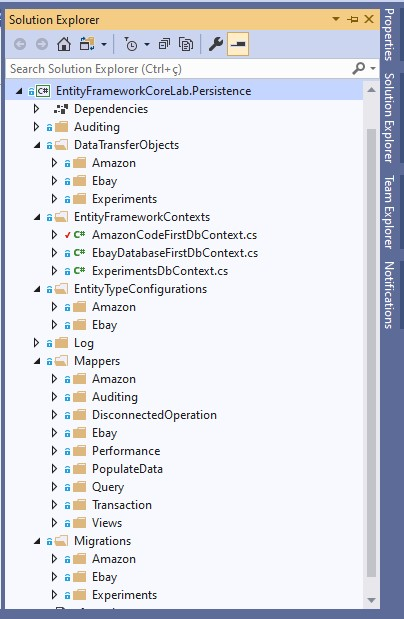

# Entity Framework Core Lab

Read this documentation in other languages: [Portuguese (pt-BR)](README-pt-BR.md)

Application created with the main objective of exploring the features and characteristics of the Entity Framework Core.

In this application, several real usage scenarios were tested based on an ecommerce mini data model.

After the case studies, the main conclusions were documented in this file and serve as a reference for use and source of consultation.

**Used Packages:**

>Net Core 3.1

>[Entity Framework Core 3.1.2](https://www.nuget.org/packages/Microsoft.EntityFrameworkCore/3.1.2)

>[Entity.Framework.Core.Sql.Server 3.1.2](https://www.nuget.org/packages/Microsoft.EntityFrameworkCore.SqlServer/3.1.2)

>[Microsoft.EntityFrameworkCore.Tools 3.1.2](https://www.nuget.org/packages/Microsoft.EntityFrameworkCore.Tools/3.1.2)

>[EFCore.BulkExtensions 3.1.1](https://www.nuget.org/packages/EFCore.BulkExtensions/3.1.1)

>[Microsoft.Extensions.Logging.Console 3.1.2](https://www.nuget.org/packages/Microsoft.Extensions.Logging.Console/3.1.2)

>[Faker.Net 1.3.77](https://www.nuget.org/packages/Faker.Net/1.3.77)

>[NBuilder 6.1.0](https://www.nuget.org/packages/NBuilder/6.1.0)

## Prerequisites

What needs to be installed on the machine to extend and debug the project:

    Visual Studio Community 2019;
    Net Core SDK 3.1;
    SQL Server

## Getting Started

* Install and/or configure all the prerequisites mentioned above;
* Clone the repository on the local machine;
* Create the three databases used in the application: AmazonCodeFirst, EbayDatabaseFirst and Experiments;
* Download Nuget dependencies for the solution in Visual Studio;
* Run the migrations to the desired database with the command: Update-Database -Context [ClassName of context];
* Execute the calling of some class from the [Process](./EntityFrameworkCoreLab.Application/Process) namespace in the Program.cs file;

## Project Requirements

In order to experience the features of the Entity Framework Core and establish the best and most efficient usage practices, some requirements have been established.

These requirements aim to bring the case study closer to a real use scenario where several characteristics of the framework must be explored.

Below are listed which requirements the solution meets:

    Use of multiple databases;
    Use of multiple schemas;
    Use Model First and Database First;
    To consider 1 x 1 relationship between tables;
    To consider 1 x N relationship between tables;
    To consider N X N relationship between tables;
    Better use of DataAnnotations;
    Behavior of Inserts;
    Behavior of Updates;
    Behavior of Deletes;
    Use of transactions;
    Use of views;
    Database seed using migrations;
    Entities that do not use an auto-incremental key;
    Evaluate and optimize performance for operations with large data volumes;
    Querys log and data audit;

## Database Model

In order to exemplify the use of the Entity Framework, a mini **database model was created that has 1 x 1, 1 x N and N x N** relationships. This model is geared towards ecommerce and is mainly based on `Customers` who live in certain `Addresses`, these customers in turn buy several `Products` and the products have related `Delivery Rates`.

Below is a **conceptual modeling** of the database. The modeling was done with the support of the tool [BrModelo](http://www.sis4.com/brModelo/).

In this diagram, **logical modeling** of the database is presented. The modeling was done with the support of the tool [SqlDBM](https://sqldbm.com/). It is important to note that the tables have been divided into two schemes: `common` and `sales`.

## Project Structure

The solution `EntityFrameworkCoreLab` is divided into two projects: `EntityFrameworkCoreLab.Application` and `EntityFrameworkCoreLab.Persistence`. Below each of the projects are detailed.

### EntityFrameworkCoreLab.Application

It is a `.Net Core Console Application` that has the responsibility of being the entry point for executing and debugging the classes developed in the solution. To perform the execution, the classes in the **Process** namespace must be instantiated and the methods executed in the **Program.cs** class.

The main namespaces are `Data Factory` and `Process`.

* **Data Factory**: classes that have the responsibility **to create fakes objects** to make some operations in the databases feasible. These objects are created with the support of the extensions NBuilder and Faker.Net.

* **Process**: classes that manage calls to the `EntityFrameworkCoreLab.Persistence` project, which in turn accesses the databases. Each class has a set of operations that seek to evaluate a specific scope of actions in EF Core.

### EntityFrameworkCoreLab.Persistence

It is a `.Net Core Class Library` which has the responsibility to maintain the EF Core configurations and carry out the operations in the databases.

The main namespaces are: `DataTransferObjects`, `EntityFrameworkContexts`, `EntityTypeConfigurations`, `Log`, `Mappers` and `Migrations`.

* **DataTransferObjects**: classes that represent the models that map the tables in each database.

* **EntityFrameworkContexts**: classes that configure access to databases. In this case study, three databases were used.

* **EntityTypeConfigurations**: classes that aim to modularize the code of configurations made for each model in DbContexts.

* **Log**: classes developed to write EF Core logs to file.

* **Mappers**: classes that perform CRUD operations on databases.

* **Migrations**: classes that represent the migrations that will be applied in each database.

## Model First x Database First

The two main strategies for manipulating, updating and creating database schema using EF Core are: `Model First and Database First`.

The strategy that the author recommends to be used is the **Model First**, however in some situations it is necessary to work with a database already defined, with a physical model already created. In this scenario, EF Core allows the **Database First** strategy to be used to use the database.

Based on this it is important that the three data model configuration strategies provided by EF Core are explained:

* **By Convention**: simple rules adopted in the types and names of properties for configuring the database schema. It does not meet all configuration scenarios;
* **Data annotation**: a set of annotations that can be used in the entity classes and properties for configuration;
* **Fluent API**: can be used when overriding the `OnModelCreating` method of the class that extends the `DbContext`. This is the most powerful and flexible way to configure the data model, however the configuration can become more complex and generate much boilerplate code.

A problem observed with the `Database First` strategy is that it creates a lot of unnecessary code or `boilerplate code`, leaving the data model created in the application more complex and often difficult to understand.

With that in mind, based on the tests and experiments carried out in the project, a way of working with existing tables was established using all the power of the **Model First** strategy.

>If the table already exists in the database, it is possible to create the `Model` based on the database structure. After the creation of this model the migration is generated normally, but its application in the database is not done. To avoid any error, an `Insert` is done in the `__EFMigrationsHistory` table with the name of the migration file and EF Core version. In this way, the Database First strategy's boilerplate code is avoided. `But, how to translate the fields from the SqlServer to C# types?` **Answer**: using the field table below.

### Fields table

This table represents the types of C# fields for the types of fields in the SqlServer. Field sizes are useful to establish the most appropriate type and configuration for each situation, in order to make a physical design of the most suitable database.

With this table it is possible to create models for tables that already exist in the database in order to avoid the boilerplate code of the Database First strategy.

The table leads us to two **important conclusions**: all **numeric types are generated as not null** in SqlServer and **string fields are generated as null**.

It is possible to check the way the table was generated by consulting the model code [DTODataType](./EntityFrameworkCoreLab.Persistence/DataTransferObjects/Experiments/DTODataType.cs).

[Migration](./EntityFrameworkCoreLab.Persistence/Migrations/Experiments/20200307214738_CreateDTODataType.cs) file that generated the table in the database from the model.

| **C# Type** |     **DataAnnotation**            |   **SqlServer Type**   | **SqlServer Lenght**  |
|:-----------:|:---------------------------------:|:----------------------:|:---------------------:|
|     int     |          -                        |  int not null          |       4 bytes         |
|     int?    |          -                        |     int null           |       4 bytes         |
|    string   |          -                        | nvarchar(max) null     |         2GB*          |
|    string   |        MaxLength(50)              |  nvarchar(50) null     |      100 bytes*       |
|    string   |         Required                  | nvarchar(max) not null |         2GB*          |
|   DateTime  | Column(TypeName = "date")         |   date not null        |       3 bytes         |
|   DateTime? | Column(TypeName = "date")         |     date null          |       3 bytes         |
|   DateTime  |           -                       | datetime2(7) not null  |       8 bytes**       |
|   DateTime? |           -                       |  datetime2(7) null     |       8 bytes**       |
|   TimeSpan  |           -                       |   time(7) not null     |       5 bytes***      |
|   TimeSpan? |           -                       |     time(7) null       |       5 bytes***      |
|    float    |           -                       |   real not null        |       4 bytes         |
|    float?   |           -                       |      real null         |       4 bytes         |
|   double    |           -                       |    float not null      |       8 bytes         |
|   double?   |           -                       |      float null        |       8 bytes         |
|     long    |           -                       |    bigint not null     |       8 bytes         |
|     long?   |           -                       |      bigint null       |       8 bytes         |
|   decimal   |           -                       | decimal(18,2) not null |       9 bytes         |
|   decimal   | Column(TypeName = "decimal(6,2)") |  decimal(6,2) not null |       5 bytes         |
|   decimal?  |           -                       |   decimal(18,2) null   |       9 bytes         |
|    bool     |           -                       |   bit not null         |       2 bytes         |
|    bool?    |           -                       |       bit null         |       2 bytes         |
|    char     |           -                       | nvarchar(1) not null   |       2 bytes         |
|    char?    |           -                       |    nvarchar(1) null    |       2 bytes         |
|    byte[]   |           -                       |   varbinary(max) null  |         2GB*          |

*Maximum value that varies according to the content of the field.

**6 bytes for accuracy less than 3, 7 bytes for accuracy between 3 and 4. All other precision needs 8 bytes.

***3 bytes for accuracy less than 3, 4 bytes for accuracy between 3 and 4. All other precision needs 5 bytes.

## Migration Strategies

### Criteria for generating migrations

### ModelSnapshot File

Migrations create a **snapshot** of the current database schema in the `Migrations/<DbContextName>ModelSnapshot.cs` file. When a migration is added, EF Core determines which changes will be applied by comparing the data model with the snapshot file.

### Main commands when using migrations

### Database Seeding

In the migration file [DatabaseSeeding](./EntityFrameworkCoreLab.Persistence/Migrations/Amazon/20200404115959_DatabaseSeeding.cs) an example of loading into the database is presented through the use of migration. Both `Insert, Update and Delete` operations are presented.

## Relationships Strategies

### One to One (1 x 1)

By default, EF Core creates a field that can assume **null values** in the database. This field is a foreign key for the dependent table and assumes the exclusion pattern `ReferentialAction.Restrict`. If `DataAnnotation [Required]` is inserted, it assumes the `ReferentialAction.Cascade` exclusion pattern.

It can be done in two ways:

1 - A property in the main class referencing the dependent class with a property in the dependent class that represents the key of the main;

2 - The reverse. A property in the main class that represents the dependent key with a property in the dependent class referencing the main class;

### One to Many (1 x N)

If the id of the main entity does not exist in the dependent entity, EF Core inserts it as `shadow property`. It is recommended to insert the id property that references the main entity for the sake of clarity in the data model.

### Many to Many (N x N)

By default, EF Core does not define the two foreign keys in the associative table as a composite primary key. An extra key must be added or a configuration used to define both fields as a key. Example:

    modelBuilder.Entity<BookCategory>().HasKey(bc => new { bc.BookId, bc.CategoryId });

It is not necessary to include the class that represents the associative table in DbSet for it to be created in the database.

## Inserts, updates and deletes considerations

### EF Core Entity State

A brief explanation of the EF Core Entity State aims to help understand what happens when entities are added, updated or deleted from the database.

When an entity is read it is `tracked` by default by EF Core, this is known as a `tracked entity`.

> Tracked entities: are instances of entities that were read from the database using a query that does not include the **AsNoTracking** method. Alternatively after an entity is used in an EF Core method (Add, Update or Delete) the entity is tracked.

All tracked entities have a property called `State`. The State of an entity can be obtained using the following command:

    context.Entry(someEntityInstance).State

Where `context` is the instance of the DbContext class used.

Below is a list of possible States and what happens when the `SaveChanges` method is executed:

* Added - The entity does not exist in the database. SaveChanges inserts it.
* Unchanged - The entity exists in the database and has not been modified on the client. SaveChanges ignores it.
* Modified - The entity exists in the database and has been modified on the client. SaveChanges updates it.
* Deleted - The entity exists in the database and has been deleted. SaveChanges the delete.
* Detached - The entity is not "tracked". SaveChanges ignores it.

Normally the `State` is not changed directly, for that, several EF Core commands are used to ensure that everything will be changed correctly.

The classes [AmazonCustomerInsertLabMapper](./EntityFrameworkCoreLab.Persistence/Mappers/Amazon/AmazonCustomerInsertLabMapper.cs), [AmazonCustomerUpdateLabMapper](./EntityFrameworkCoreLab.Persistence/Mappers/Amazon/AmazonCustomerUpdateLabMapper.cs) and [AmazonCustomerDeleteLabMapper](./EntityFrameworkCoreLab.Persistence/Mappers/Amazon/AmazonCustomerDeleteLabMapper.cs) present examples of how the different states of the `State` property influence the operations sent to the database by DbContext. For better interpretation it is necessary to pay attention to the comments inserted in the code.

> It is highly recommended that the **State** property is not changed directly via code in real applications.

## Insert and update use examples

The class [DisconnectedOperationProcess](./EntityFrameworkCoreLab.Application/Process/DisconnectedOperationProcess.cs) and its dependencies present examples of how to perform inserts and updates on entities with 1 x 1, 1 x N and N x N relationships.

The operations are carried out in a `disconnected` way, that is, the entities have not yet been tracked by DbContext. The [FullPopulateDatabaseDataProcess](./EntityFrameworkCoreLab.Application/Process/FullPopulateDatabaseDataProcess.cs) class also provides a good example of how to insert data into entities.

## Performance considerations

The purpose of this session is mainly to explore the various possibilities of data manipulation using EF Core in terms of performance.

It is important to evaluate the data collected from the point of view of `order of magnitude`, that is, if strategy A needs 10ms and strategy B needs 1ms to do the same operation, then strategy B is more efficient. However, it does not mean that strategy B will run at the same time on different hardware.

With that in mind, don't take the time spent on each strategy so much into consideration, but **how often it is more efficient** compared to the others.

Evaluations were made for the Insert, Update and Delete operations. For the tests the following forms of execution were used:

* **Add**: evaluated the method that is part of both DbSet and DbContext;
* **AddRange**: evaluated the method that is part of both DbSet and DbContext;
* **ExecuteSql**: Use of pure SQL through DbContext;
* **Bulk Operation**: Use of Bulk operations on SQL Server through DbContext and the **EFCore.BulkExtensions** extension.

The operations that are described as `with Recycle` mean that the DbContext instance has been recreated for each database call.

For testing purposes **15,000 addresses** were created using the **NBuilder** and **Faker.Net** extensions.

The data below are presented in **Milliseconds per record**.

### INSERT

To consult the code used, check the class [PerformanceInsertLabProcess](./EntityFrameworkCoreLab.Application/Process/PerformanceInsertLabProcess.cs).

| **INSERT BENCHMARK**             |  DbSet  | DbContext |
| -------------------------------- |:-------:|:---------:|
| **Add**                          | 11,63*  |  10,51*   |
| **Add with Recycle**             |  9,56   |  12,11    |
| **AddRange**                     |  0,25   |   0,24    |
| **AddRange with Recycle**        |  0,25   |   0,23    |
| **ExecuteSql**                   |    -    |   5,13    |
| **ExecuteSql with Recycle**      |    -    |   7,67    |
| **Bulk Operation**               |    -    |   0,02    |

*With the use of the same instance of DbContext and successive calls to `SaveChanges` the time spent per registration increases with the increase in operations.

### UPDATE

To consult the code used, check the class [PerformanceUpdateLabProcess](./EntityFrameworkCoreLab.Application/Process/PerformanceUpdateLabProcess.cs).

| **UPDATE BENCHMARK**             |  DbSet  | DbContext |
| -------------------------------- |:-------:|:---------:|
| **Add**                          |  9,06*  |  13,27*   |
| **Add with Recycle**             |  9,23   |  10,00    |
| **AddRange**                     |  0,23   |   0,23    |
| **AddRange with Recycle**        |  0,24   |   0,22    |
| **ExecuteSql**                   |    -    |   6,11    |
| **ExecuteSql with Recycle**      |    -    |   5,57    |
| **Bulk Operation**               |    -    |   0,03    |

*With the use of the same instance of DbContext and successive calls to `SaveChanges` the time spent per registration increases with the increase in operations.

### DELETE

To consult the code used, check the class [PerformanceDeleteLabProcess](./EntityFrameworkCoreLab.Application/Process/PerformanceDeleteLabProcess.cs).

| **DELETE BENCHMARK**             |  DbSet  | DbContext |
| -------------------------------- |:-------:|:---------:|
| **Add**                          | 23,90*  |  29,27*   |
| **Add with Recycle**             | 24,33   |  28,30    |
| **AddRange**                     |  0,20   |   0,21    |
| **AddRange with Recycle**        |  0,17   |   0,16    |
| **ExecuteSql**                   |    -    |   5,43    |
| **ExecuteSql with Recycle**      |    -    |   5,90    |
| **Bulk Operation**               |    -    |   0,03    |

*With the use of the same instance of DbContext and successive calls to `SaveChanges` the time spent per registration increases with the increase in operations.

### Considerations about data

* The code using Bulk Operation is the most efficient. It should be used for large masses of data that need to be processed in a short time;
* Whether or not to recreate the DbContext instance did not change the time spent on operations;
* The use of the call `SaveChanges` should only be made after including all the data in DbContext, EF Core has optimizations so that the data can be processed more quickly.
* Among all strategies, the one using `AddRange` proved to be the strategy with the best cost benefit. It has excellent performance using only native EF Core features.

## Considerations about selects

### Eager loading

### Explicit loading

### Lazy loading

### Select loading

### Which strategy to use?

### Raw SQL in querys

### Query examples

## Transactions

By default, EF Core's DbContext class performs database operations within a transaction. Based on this, it is possible to make several calls to the `Add/AddRange, Update/UpdateRange and Remove/RemoveRange` methods of the same DbContext instance that when calling the` SaveChanges` the operations will be executed within a transaction. Based on this, **in most scenarios it is not necessary to use transactions explicitly in EF Core**.

The [TransactionLabProcess](./EntityFrameworkCoreLab.Application/Process/TransactionLabProcess.cs) and [EbayTransactionLabMapper](./EntityFrameworkCoreLab.Persistence/Mappers/Transaction/EbayTransactionLabMapper.cs) class present several examples that evaluate the behavior of transactions in DbContext.

It is important to pay attention to some `comments` in the [TransactionLabProcess](./EntityFrameworkCoreLab.Application/Process/TransactionLabProcess.cs) class that explain the behavior of each evaluated scenario.

To see an example of using the transaction `explicitly` the method` InsertAddressWithAddWithTransactionSaveChangesBefore` of class [EbayTransactionLabMapper](./EntityFrameworkCoreLab.Persistence/Mappers/Transaction/EbayTransactionLabMapper.cs) should be used as an example.

## Views

You can use views in EF Core by following these steps:

1 - The view sql script is created;

2 - The **model** is created to represent the view in the application using this [Table](#table-of-fields)*;

3 - The view creation script is applied directly to the database or through migration;

4 - Performs the inclusion of an entry for the model in the DbContext and the instruction below in the `OnModelCreating` method of the DbContext;

    modelBuilder.Entity<TEntity>().ToView("ViewName", "schemaName");

*The use of the table is optional, however its objective is to approximate as much as possible the types and annotations of the model with the types established in the database.

The [SalesInsightsProcess](./EntityFrameworkCoreLab.Application/Process/SalesInsightsProcess.cs) and [SalesInsights](./EntityFrameworkCoreLab.Persistence/DataTransferObjects/Amazon/SalesInsights.cs) classes and their dependencies present an example of using views. In this example, the view was created directly in the database without using migration.

Below is an example of migration that creates a view:

    public partial class CreateView : Migration
    {
        protected override void Up(MigrationBuilder migrationBuilder)
        {
            migrationBuilder.Sql("create view SomeView as select * from SomeTable");
        }
        protected override void Down(MigrationBuilder migrationBuilder)
        {
            migrationBuilder.Sql("drop view SomeView");
        }
    }

## Logging

It is possible to use the [Microsoft.Extensions.Logging.Console](https://www.nuget.org/packages/Microsoft.Extensions.Logging.Console/3.1.2) extension to capture logs of the operations applied in the database.

This log can be presented either in the console, in the development environment, or recorded in a file for later verification. The main utility of these logs is to identify any errors or eventual queries that have performance problems.

In class [AmazonCodeFirstDbContext](./EntityFrameworkCoreLab.Persistence/EntityFrameworkContexts/AmazonCodeFirstDbContext.cs), an implementation was made to present the log on the console using the `LoggerFactoryToConsole` property.

The implementation of the log in file was done through the `LoggerFactoryToFile` property using classes that extend some interfaces of the Microsoft log package. These classes are in the [Log](./EntityFrameworkCoreLab.Persistence/Log/) namespace.

To use the log in file, just use the call `optionsBuilder.UseLoggerFactory (LoggerFactoryToFile)` in the `OnConfiguring` method of DbContext.

## Data Audity

In some situations, it is necessary to record the creation, update and deletion times of the records manipulated in the database, as well as the user who performed these operations.

In order to avoid duplication of code, the `SaveChanges` method of DbContext [EbayDatabaseFirstDbContext](./EntityFrameworkCoreLab.Persistence/EntityFrameworkContexts/EbayDatabaseFirstDbContext.cs) was overwritten. This overwrite applies the audit data in the database to entities that are of the type [Auditable](./EntityFrameworkCoreLab.Persistence/Auditing/Auditable.cs). An example of an entity that uses auditing is the entity [Customer](./EntityFrameworkCoreLab.Persistence/DataTransferObjects/Ebay/Customer.cs).

## Fast tips

### Indexes

**Create an index**
    
    modelBuilder.Entity<MyEntity>().HasIndex(p => p.MyProp); 

**Create index with multiple fields**

    modelBuilder.Entity<MyEntity>().HasIndex(p => new {p.MyProp01, p.MyProp02}); 

**Create named index**

    modelBuilder.Entity<MyEntity>().HasIndex(p => p.MyProp).HasName("Index_MyProp");

**Create unique index (unique key)**

    modelBuilder.Entity<MyEntity>().HasIndex(p => p.MyProp).IsUnique();

### Schemas and Tables

**Apply schema and table name (Data Annotation)**

    [Table("TableName", Schema = "SchemaName")]
    public class MyEntity
    {

    }

**Apply schema and table name (Fluent API)**

    modelBuilder.Entity<MyEntity>().ToTable("TableName", "SchemaName");

**Default value columns**

    modelBuilder.Entity<MyEntity>().Property(p => p.MyProp).HasDefaultValue(3);

    modelBuilder.Entity<MyEntity>().Property(p => p.MyProp).HasDefaultValueSql("getdate()");

### Primary keys

**Create table without primary key**

    modelBuilder.Entity<MyEntity>().HasNoKey();

**Create table with primary key without autoincrement**

    modelBuilder.Entity<MyEntity>().Property(p => p.MyProp).ValueGeneratedNever();

**Create table with compound primary key**

    modelBuilder.Entity<MyEntity>().HasKey(p => new { p.MyProp01, p.MyProp02 });

### Raw SQL

It is possible to use raw sql with the Entity Framework Core if necessary. Just use the following call:

    context.Database.ExecuteSqlInterpolated(stringSqlWithCommand)

Where `context` is the instance of DbContext used and `stringSqlWithCommand` is the desired sql command. The call executes the sql command on the database and returns the number of rows affected.

It is important to reinforce the importance of avoiding `SQL Injection` failures. For this, it is important to use `string interpolation` in the construction of the sql command. EF Core already translates this command using parameters that prevent SQL Injection errors.

Example of a sql command that uses string interpolation:

    context.Database.ExecuteSqlInterpolated($"delete from common.Address where Id={address.Id}")

If you want to build the command in a separate method, the return type `FormattableString` should be used.

    private FormattableString GetDeleteAddressSql(Address address)
    {
      return $"delete from common.Address where Id={address.Id}";
    }

**It is important to reinforce that the use of raw SQL with Entity Framework Core is not recommended, being advisable only in exceptional cases.**

### Organize Fluent API in DbContext

Sometimes, over time, the use of the Fluent API in the `OnModelCreating` method of DbContext can leave the class with excessive lines, making maintenance a little more difficult and increasing complexity.

EF Core has a feature to better organize this code. This is the use of the `IEntityTypeConfiguration` interface. An example of this feature is presented in class [CustomerTypeConfiguration](./EntityFrameworkCoreLab.Persistence/EntityTypeConfigurations/Ebay/CustomerTypeConfiguration.cs), in which some configurations of the entity were defined. These settings are applied at [EbayDatabaseFirstDbContext](./EntityFrameworkCoreLab.Persistence/EntityFrameworkContexts/EbayDatabaseFirstDbContext.cs).

## Lessons learned

## References used

* [Entity Framework Core Official documentation](https://docs.microsoft.com/en-us/ef/core/index)
* [Entity Framework Core in Action book](https://livebook.manning.com/book/entity-framework-core-in-action/about-this-book/)
* [Entity Framework Core Tutorial](https://www.entityframeworktutorial.net/efcore/entity-framework-core.aspx)
* [Learn Entity Framework Core](https://www.learnentityframeworkcore.com/)
* [Blog of Entity Framework Core in Action Author - John P Smith](https://www.thereformedprogrammer.net/)
* [Blog of Engineering Manager for Entity Framework - Arthur Vickers](https://blog.oneunicorn.com/)
* [Entity Framework Core Specialist - Julie Lerman](http://thedatafarm.com/)
* [Pluralsight - Entity Framework Core Path](https://www.pluralsight.com/paths/entity-framework-core)
* [Pluralsight - Entity Framework Core in the Enterprise](https://app.pluralsight.com/library/courses/entity-framework-enterprise-update/table-of-contents)

## Authors

* **Stenio Nobres** - [Github](https://github.com/stenionobres)